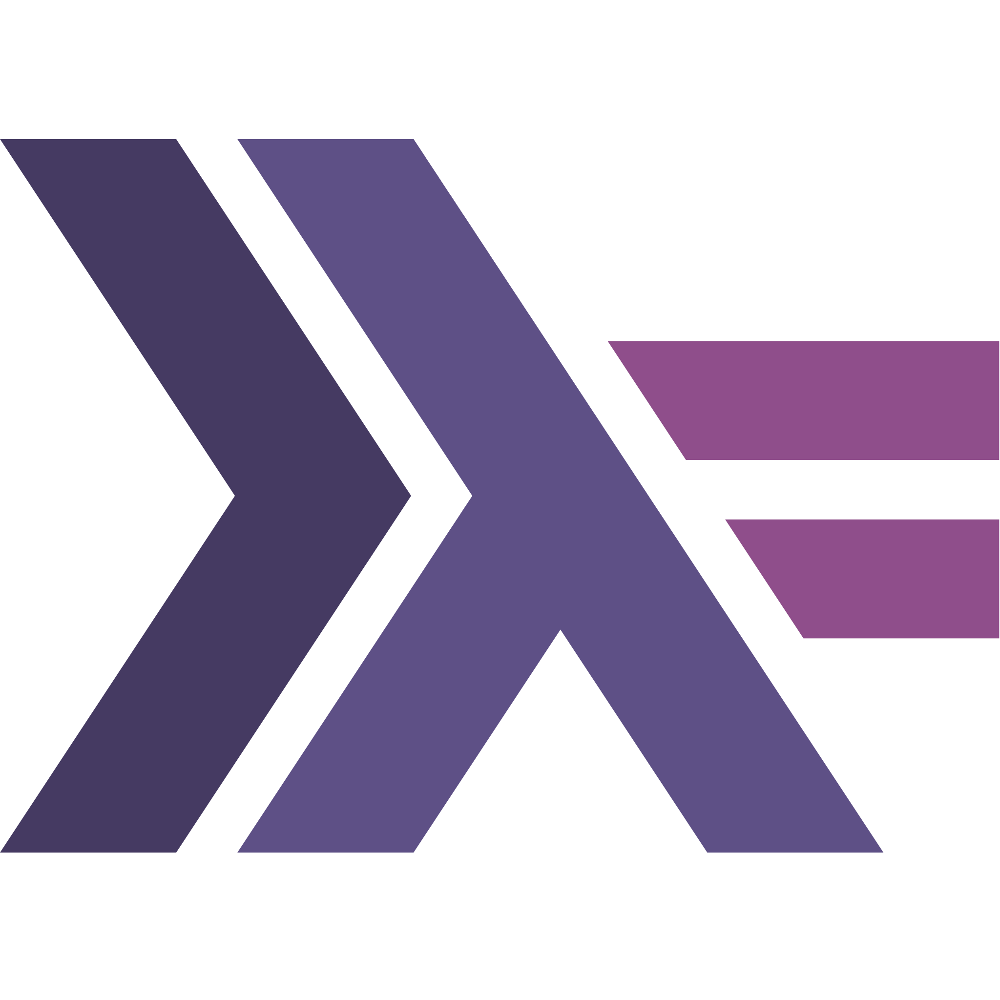

## Olá Devs :wave:, 

  <samp>
  
  
    Eu sou Robson, atualmente tenho 20 anos, sou estudante de Ciência da Computação na <a href="http://www.ufu.br/">@UFU</a> :school: e aspirante a Desenvolvedor Mobile :iphone: </a>  Interessado em trabalhar em segurança da informação, backend, API's.
     Atualmente estudando Pentest e Flutter.
  </samp>

### Linguagem de Programação :computer:
|||||
|:---:|:---:|:---:|:---:|

### Frameworks :wrench:
|||
|:---:|:---:|

### Ferramentas :rocket:
||||
|:---:|:---:|:---:|

### Entre em contato :speech_balloon:

 
  
